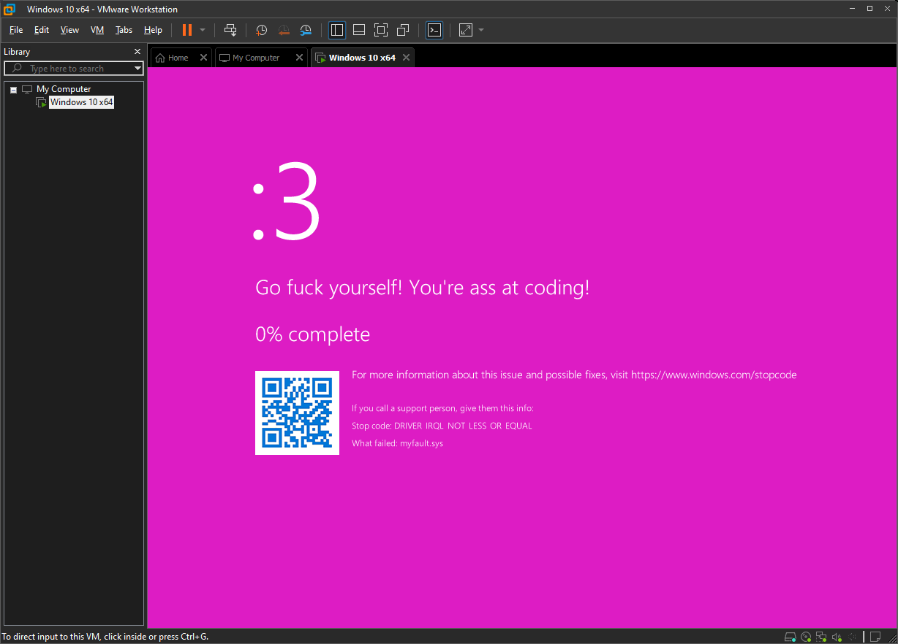

# EditBlueScreen

Allows you to overwrite your bluescreen color and text contents using a Windows Kernel Driver.



## Configuration

If you want to change the text and color of the bluescreen, you can edit the `Config.h` file. The file contains the following fields:

```cpp
#define BSOD_FACE           L":3"
#define BSOD_FIRST_MESSAGE  L"Go fuck yourself!"
#define BSOD_SECOND_MESSAGE L"You're ass at coding!"
#define BSOD_COLOR          0xFFDD1CC4               // Stored as: 0xAARRGGBB
```

Just recompile and the driver and load it and the message will be updated.

## Usage

This requires test signing to be enabled:

```batch
bcdedit /set testsigning on
shutdown /r /t 0
```

Create and start the service:

```batch
sc create EditBlueScreen binPath= C:\path\to\EditBlueScreen.sys type= kernel start= auto
sc start EditBlueScreen
```

**Hint:** It's normal for it to show that it failed to load, since it always returns that it failed even if it didn't.

Now, just cause a blue screen using any application like [NotMyFault](https://learn.microsoft.com/ms-my/sysinternals/downloads/notmyfault)
or your favorite broken game:

```batch
notmyfaultc.exe crash 0x01
```
